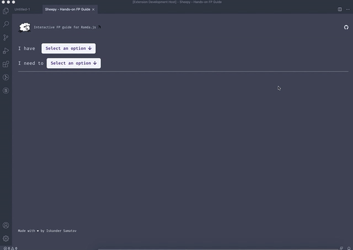

# Sheepy - VSCode extension to learn Functional Programming with Ramda.JS

Sheepy is an interactive FP guide for Ramda.JS built as a VSCode extension. 

One of the biggest challenges when starting out with FP is picking the right function for each use-case. This interactive guide will help you identify the right function for your task.

## Run locally
To run the project locally in VSCode run `yarn run build` or `yarn watch-build` from the root directory. After the code finishes compiling, you can run the extension using F5 key.

## Contributing
Pull requests are welcome. For major changes, please open an issue first to discuss what you would like to change.
